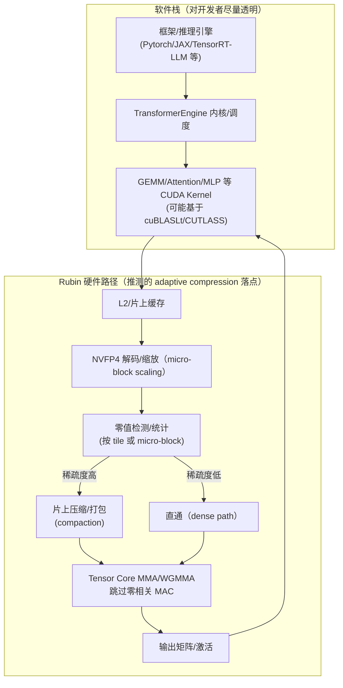

# 英伟达 Rubin 平台“Adaptive Compression”与非结构化稀疏软硬件协同实现深度研究报告

执行摘要：本次检索覆盖两条用户指定的 GitHub issue、TransformerEngine 公开仓库的提交记录与文档、英伟达官方博客/官网技术页、以及若干会议/媒体/第三方技术分析与学术资料。结论是：截至 2026-04-09（东京时间），英伟达对 Rubin 第三代 Transformer Engine（TE）的“hardware-accelerated adaptive compression”仅给出一致但高度概括的公开描述，并未披露算法流程、压缩格式或可复现实验代码；TransformerEngine 开源仓库与官方 TE 文档同样未出现“adaptive compression”的实现细节或 API 入口（至少在公开主干与已发布版本范围内）。因此，报告以“已证实事实”为基线，结合多源证据对可能实现路径进行约束性推断：最符合官方“兼容 Blackwell、无需新编程模型、自动获益”的表述的方案，是在 Rubin 硬件/微架构层面对 NVFP4 数据流做**动态零值识别与片上压缩/跳零（zero-skipping）**，利用推理阶段（尤其 NVFP4 量化后）出现的“自然零值/近零值量化为零”带来的**非结构化稀疏**，把“有效计算吞吐（effective FLOPs）”抬升到宣传的 50 PFLOPS（推理）而训练峰值仍以更趋近“稠密路径”的 35 PFLOPS 口径公布。该解释与官方“提升 NVFP4 性能且保持精度”的措辞相容，也与第三方对“in-flight 计算稀疏并消除零值数据流”的描述相吻合。citeturn24view2turn26search4turn5search2turn5search7  

## 证据基线与检索范围

本报告将证据按可信度分为三层：  
第一层（官方/原始资料）：英伟达技术博客中文版与官网技术页对 Rubin/Transformer Engine 的描述；英伟达新闻稿；TransformerEngine 官方文档与公开源码/提交记录。citeturn24view2turn26search4turn5search2turn13view2turn34view0  
第二层（社区一手问题）：用户给出的两条 TransformerEngine GitHub issue（#2565、#2807），它们直接反映“官方未解释”的缺口与外部开发者关注点。citeturn26search2turn5search3  
第三层（第三方分析/媒体/学术）：例如 entity["organization","SemiAnalysis","semiconductor analysis media"] 对 Rubin “adaptive compression engine”的推断性描述，以及媒体采访中“更适合生成式 AI/MoE 推理”的表述；结构化稀疏方面使用英伟达公开白皮书与官方博文作为对照。citeturn5search7turn4view0turn35search0turn35search1  

在“明确检索范围”要求下，本次实际纳入整合的关键入口包括：  
- GitHub issue：#2565、#2807（均为公开但未见官方技术细节回应）。citeturn26search2turn5search3  
- TransformerEngine：主干提交记录可见 NVFP4、量化、融合内核与若干行为控制开关的演进，但提交信息层面未见“adaptive compression”相关关键词或明确 Rubin 专属实现入口。citeturn34view0turn13view2  
- 官方博客/官网：中文长文明确写出“硬件加速自适应压缩（hardware-accelerated adaptive compression）用于提升 NVFP4 且保持精度，使 NVFP4 推理可达 50 PFLOPS”，并强调与 Blackwell 编程模型兼容、旧代码可“自动获益”。citeturn24view2turn26search4turn5search2  
- 结构化稀疏对照材料：A100 2:4 结构化稀疏定义、压缩/元数据与“跳零翻倍吞吐”的机制在官方材料中有明确阐述。citeturn35search0turn35search3turn35search11  

## 目标、算法流程与压缩格式

### 已证实事实

1) **目标（官方口径）**：Rubin 第三代 Transformer Engine 增加“硬件加速自适应压缩”，其目标是“提升 NVFP4 性能并保持精度”，并使 NVFP4 推理峰值可达 50 PFLOPS。citeturn24view2turn26search4turn5search2  

2) **兼容性约束（对实现方案形成强约束）**：官方强调“与 Blackwell 完全兼容、保留既有编程模型、已优化代码可无缝迁移并自动获益”。这暗示该特性要么（a）对上层 API 透明、要么（b）仅通过库内部自动选择路径、无需用户显式提供新稀疏格式。citeturn24view2turn26search4  

3) **与稀疏路径相关的硬件语境**：官方中文长文在介绍 Rubin GPU 时提到 Tensor Core 与执行管线被设计用于加速“注意力、激活函数以及稀疏计算路径”。这表明“稀疏/跳零”至少在 Rubin 的硬件叙事中占有位置，但仍未给出“非结构化 vs 结构化”的明示。citeturn24view3  

4) **NVFP4 的数据分块背景**：NVFP4 在 Blackwell 上的公开描述显示，它采用“微块（micro-block）尺度因子”的思路：例如“每 16 个值共享 FP8 scaling（并叠加二级缩放策略）”来改善 4-bit 表示的精度风险；这给“adaptive compression”可能复用的分块粒度提供了现实候选（例如以 16 值 micro-block 为最小统计/压缩单元）。citeturn22view2  

image_group{"layout":"carousel","aspect_ratio":"16:9","query":["NVIDIA Vera Rubin platform chips lineup","NVIDIA Rubin GPU HBM4 22 TB/s 50 PFLOPS NVFP4 graphic","NVIDIA Transformer Engine NVFP4 illustration","NVIDIA A100 structured sparsity 2:4 diagram"],"num_per_query":1}  

### 关键未知与可约束推断

由于官方未公开算法细节（GitHub issue 亦在追问且未见公开回应），以下为“多方案推测”，并明确置信度与依据。

#### 候选实现方案比较

| 方案 | 核心思想 | 可能的“压缩格式/数据结构” | 与“无需新编程模型”的兼容性 | 主要优点 | 主要风险/缺点 | 置信度 |
|---|---|---|---|---|---|---|
| 方案 A：片上流式零值压缩（in-flight compaction / zero-skipping） | 在 operand 进入 Tensor Core 计算管线前，硬件快速检测零值并在片上压缩数据流，减少无效 MAC | **对软件不可见**；片上临时 bitmask/计数器；可能以 NVFP4 micro-block（16 值）或更细粒度为单位 | **最强**：完全透明，符合“自动获益”叙事 | 不引入全局稀疏格式转换开销；可随张量统计自适应启用/禁用 | 若零值比例不足，检测/压缩逻辑可能成为开销；需要复杂片上 shuffle/路由网络 | 中（受官方“自动获益”强约束支持，且与第三方“in-flight”描述契合）citeturn24view2turn5search7 |
| 方案 B：库生成元数据 + 新型稀疏 MMA 指令 | TE/内核在运行时扫描张量生成稀疏元数据，调用新指令在 Tensor Core 侧跳零 | 可能是“bitmap + packed values”的 tile-sparse；或更一般的 CSR/COO 的 tile 化变体 | 中：仍可由库自动触发，但需要显式元数据与额外 kernel | 更可控；可在库层做阈值与策略切换 | 元数据生成开销大；非结构化索引带宽/寄存器压力高；对 shape/布局敏感 | 低-中（缺乏公开 API/格式证据） |
| 方案 C：自适应“数值压缩”（非稀疏） | 根据层/张量统计在 NVFP4 内部做可变比特/可变范围编码（更像 entropy/precision adaptation） | 变长编码、分段码本或多级量化（对外仍宣称 NVFP4） | 中：可隐藏在硬件/库内部 | 能解释 “compression” 一词而不依赖大量零值 | 实现复杂且缺少公开迹象；若改变非零值编码，难以保证“保持精度”且与第三方“跳零”描述不一致 | 低 |

> 约束性结论：在目前公开证据下，**方案 A（片上流式零值压缩/跳零）是最能同时满足**“硬件加速”“保持精度”“无需新编程模型”“推理峰值高于训练峰值”**四个约束的候选**。citeturn24view2turn26search4turn5search7  

### 建议性流程图（以方案 A 为主的“可解释模型”）



“保持精度”的关键点在于：压缩/跳零只对“已经等于 0 的量化值”生效，而不是主动把非零裁剪为零；这样不会引入额外数值误差（相对于输入张量已呈现的 NVFP4 表示）。这一表述与第三方“eliminating zeros … without zeroing out non-zero values”的描述一致，但该描述本身不属于官方披露。citeturn5search7turn24view2  

## 非结构化稀疏下的 FLOPs 节省机制与量化估计

### 将“50 PFLOPS（推理） vs 35 PFLOPS（训练）”解释为稀疏带来的有效吞吐

官方公开的两组数字是：NVFP4 推理“最高 50 PFLOPS”、NVFP4 训练“35 PFLOPS”。citeturn24view3turn5search2turn26search4  

如果把 35 PFLOPS 视为“稠密（dense）NVFP4 路径峰值”，把 50 PFLOPS 视为“在一定零值比例下，通过跳零得到的有效吞吐（effective FLOPs）”，则可用简单模型反推需要的“可跳零比例”。

- 对一个以 MAC 为主的算子（如 GEMM），稠密 FLOPs 约为：  
  \[
  \text{FLOPs}_{dense} = 2MNK
  \]
- 若某一输入 operand（例如激活 A）在量化后出现零值比例 \(s\)，并且硬件能**完美跳过**与零相关的乘加，则有效 FLOPs 约为：  
  \[
  \text{FLOPs}_{eff} \approx \frac{2MNK}{1-s}
  \]
  （等价于在同样时间内完成更多“非零相关”的有意义乘加）

令 \(\text{FLOPs}_{eff}/\text{FLOPs}_{dense} = 50/35 \approx 1.43\)，得到：  
\[
1/(1-s)=1.43 \Rightarrow s \approx 0.30
\]

这意味着：若 Rubin 的“adaptive compression”主要利用“NVFP4 推理中出现的自然零值”，那么实现宣传级别的 50 PFLOPS（相对 35 PFLOPS）只需要**约 30% 的可跳零比例**（在完美跳零且仍 compute-bound 的理想化前提下）。这与第三方将 Rubin 的 50 PFLOPS解释为“越稀疏越接近 50 PFLOPS”的叙事方向一致，但具体稀疏度与可达程度仍属未公开。citeturn5search7turn24view2  

### 零值来源与“非结构化稀疏”的合理性

在 Transformer 推理中，零值可来自：  
- **量化下溢**：NVFP4 只有 4-bit“微浮点”有效码点，范围与分辨率受限，小幅值在量化后变为 0 的概率显著上升；NVFP4 通过 micro-block scaling 缓解精度风险，但并不意味着不会出现 0。citeturn22view2  
- **模型/算子本身的稀疏性**：部分激活函数/门控结构、MoE 路由带来的 token-to-expert 分配等可能使某些张量块在特定 batch/序列上呈现稀疏或块稀疏；官方也强调 Rubin 面向 MoE 与推理“上下文阶段”的优化。citeturn25view0turn24view2  

“adaptive compression”的命名与官方“保持精度”措辞，使“只利用已为 0 的值”成为最保守且自洽的解释框架。citeturn24view2turn5search7  

### 算子层面：从稠密到“跳零”的具体变换与开销讨论

以最典型的 Transformer 线性层为例：  
- 稠密计算通常落在 GEMM：\(Y = XW\)。  
- 若 \(X\)（激活）或 \(W\)（权重）在 NVFP4 表示下出现零值，跳零实现可视为把 K 维度上的“零项”从 MAC 累加中剔除。  
- 对于**非结构化**稀疏，关键难点不是数学上能否跳零，而是：  
  1) 如何用低开销表示零位置（索引/bitmask）；  
  2) 如何在 GPU 的 tile-based Tensor Core 计算中维持高利用率（计算密度）。  

若采用“显式稀疏格式”（方案 B），常见选择的“元数据开销”可粗略估算：  
- **bitmap（按 g 元素一组）**：元数据 g-bit，数据 g×4-bit（NVFP4 不计 scale）。相对开销约为 \(g/(4g)=25%\)。若还要存 nonzero pack 的排序/计数，开销更大。  
- **COO/CSR**：需要存行指针与列索引，索引通常至少 16-bit/32-bit；在 4-bit 值场景下，索引可能比数据本身更“贵”，使不规则稀疏在带宽上得不偿失。  

因此，“方案 A 的片上临时元数据（不落入外存、不改变对外格式）”在工程上更能解释官方的“透明兼容”叙事。citeturn24view2turn5search7  

### 给出一个具象计算示例（含假设）

假设要计算一个典型 MLP/投影 GEMM：  
- \(M = 4096\)（token×batch 合并后），\(K=N=16384\)（隐藏维/中间维量级示例）  
- 稠密 FLOPs：\(2MNK = 2\times 4096\times 16384\times 16384 \approx 2.2\times 10^{12}\)  
- 若 Rubin 稠密 NVFP4 峰值按 35 PFLOPS 计，则理想 compute-bound 时间约：  
  \[
  t_{dense} \approx 2.2e12 / 35e15 \approx 6.3e-5s = 63\mu s
  \]
- 若零值比例 \(s=0.30\)，且“adaptive compression”能完美跳零且仍 compute-bound，则：  
  \[
  t_{ac} \approx (1-s)\,t_{dense} \approx 44\mu s
  \]

但现实会受到**内存带宽与访存形态**约束：官方披露 Rubin HBM4 总带宽可达 22 TB/s（远高于前代叙事），这会把更多算子推回 compute-bound 区间，从而让跳零带来的“算术密度提升”更可能转化为端到端收益。citeturn24view2turn24view3  

## 软硬件协同实现路径与工程权衡

### 已证实的软件生态与库落点

官方中文长文把 Rubin 的优化落在“内核与库层的深度协同”，并点名 cuDNN、CUTLASS、FlashInfer 与 Transformer Engine 等作为基础模块。citeturn24view2  

TransformerEngine 官方文档侧重 FP8/NVFP4 的配方、量化、缩放因子与相关 API（例如 C/C++ API 结构体与数据类型枚举），但未出现“adaptive compression”条目。citeturn13view2turn14view0  

### 硬件侧需要具备的关键能力（以“跳零/压缩数据流”为主线）

结合官方“硬件加速 + 透明兼容”的约束，合理的硬件支持清单可表述为（其中具体实现细节未公开）：  
- **在 Tensor Core feed 路径上进行零值快速检测与统计**：需要极低延迟的 nibble-level（4-bit）比较/掩码生成能力。  
- **片上压缩/打包与调度**：在 tile 内部把非零片段重排以提高有效 MAC 密度；或提供“可变有效 K”循环展开能力。  
- **在 MMA/WGMMA 层面跳过零相关 MAC**：类似 A100 结构化稀疏通过“Sparse MMA instructions skip zeros”实现吞吐翻倍，但这里需放宽到更一般的稀疏分布（假设）。citeturn35search0turn24view2  

> 关键差异在于：A100 的 2:4 结构化稀疏有固定模式，允许低成本压缩与低元数据；而“非结构化”稀疏若要达到明显加速，必须把元数据成本与不规则访存成本“藏进硬件”或“通过片上临时策略消化”。citeturn35search0turn35search1turn5search7  

### 可行实现路径对比（含工程复杂度与性能预期）

| 路径 | 软硬件改动范围 | 对开发者可见性 | 工程复杂度（相对） | 性能预期（相对） | 与官方叙事一致性 |
|---|---|---|---|---|---|
| 路径 1：硬件透明跳零（方案 A） | Rubin SM/Tensor Core/数据通路增加检测与压缩逻辑；软件基本不变 | 不可见 | 高（硬件复杂） | 对“自然零值较多”的推理工作负载，高；对稠密训练低 | **高**：符合“无需新编程模型、自动获益”citeturn24view2turn26search4 |
| 路径 2：库内部生成元数据 + 新内核（方案 B 的自动化形态） | TE/CUTLASS 增加扫描/压缩 kernel 与新 MMA 路径；可能需新 PTX/ISA 支持 | 低可见（自动触发） | 高（软硬一体） | 取决于扫描/压缩开销与稀疏度；易出现 shape 敏感 | 中：仍可“自动”，但更难保证对所有模型无侵入 |
| 路径 3：显式稀疏 API（类似 cuSPARSELt 的非结构化扩展） | 新库/API/格式；用户需提供或训练稀疏权重 | 可见 | 中-高 | 理论上可高，但生态迁移成本大 | 低：不符合“保留既有编程模型”的公开表述citeturn24view2turn35search7 |

另外，TransformerEngine 开源仓库的近期提交记录显示其持续引入与 FP4/NVFP4/量化相关的内核与行为控制（例如某些 backward 行为覆盖开关），但这些属于“低精度训练/推理工程化”，并不能直接等价于 Rubin 的“硬件自适应压缩”公开承诺。citeturn34view0turn26search2  

## GitHub issue 逐条回应与置信度

本节严格围绕用户指定的两条 issue：#2565 与 #2807。两条 issue 均处于“追问机制细节/示例”的状态，本报告在“公开信息不足”处给出**带置信度标注**的推测，并明确可验证方法。

### Issue #2565 的问题与回答

> Issue 背景：提问者引用官方 Rubin 平台长文中关于“hardware-accelerated adaptive compression”的一句话，询问技术机制与训练/推理峰值差异原因。citeturn26search2turn24view2  

**问题：能否说明第三代 Transformer Engine 中“硬件加速自适应压缩”的技术机制？**citeturn26search2  

回答（已证实事实）：官方仅公开其目标（提升 NVFP4 且保持精度）与结果口径（推理最高 50 PFLOPS），未披露算法/格式/接口。citeturn24view2turn26search4turn5search2  

回答（合理推测，多方案，置信度标注）：  
- 推测 A（中）：自适应压缩主要对 **NVFP4 推理数据流中的“零值”做片上压缩/跳零**，从而将“有效吞吐”抬升到 50 PFLOPS；这一推测与第三方“in-flight eliminating zeros”描述一致，并与官方“保持精度”“无需新编程模型”约束相容。citeturn5search7turn24view2  
- 推测 B（低-中）：自适应压缩可能通过库/硬件协同生成 tile 级 bitmap 元数据，再走新型稀疏 MMA 内核；但目前 TE 开源与文档未提供对应格式/API 线索。citeturn13view2turn34view0  
- 推测 C（低）：自适应压缩并非稀疏，而是可变比特/可变范围编码；目前缺乏可核验公开迹象，且与社区普遍将其与“稀疏”关联的提问方式不吻合。citeturn26search2turn5search7  

可验证方法（可复现/可检查）：  
1) 代码检索：在 TransformerEngine 源码中全文搜索 “adaptive compression / Rubin / compress / sparse”，记录是否存在宏、环境变量或内核路径；若无，则更支持“硬件透明”假设。citeturn34view0turn13view2  
2) 硬件到手后（Rubin）：用 Nsight Compute 对 NVFP4 GEMM/Attention kernel 做指令与 stall 分析，观察是否存在新的 tensor pipe 指令类别或显著减少的 tensor pipe 指令数（在输入零值比例变化时呈现敏感性）。  
3) 统计驱动：在 Blackwell 上模拟（见“可复现验证方案”），估算 NVFP4 量化后零值比例是否可达到 ~30%（对应 50/35 的简单反推），并测试性能对零值比例的单调性。

**问题：导致训练（35 PFLOPS）与推理（50 PFLOPS）NVFP4 性能差异的关键因素是什么？**citeturn26search2  

回答（已证实事实）：官方只给出两组峰值数字与“adaptive compression 用于提升推理 NVFP4”的概述，并未解释为何训练峰值更低。citeturn24view2turn26search4turn5search2  

回答（推测，按可能性排序）：  
- 推测 1（中）：推理阶段 NVFP4 张量呈现“更高的可压缩性/零值比例”，adaptive compression 因而使推理有效吞吐更接近 50 PFLOPS；训练阶段更接近稠密路径或受额外数值策略影响，收益较小，所以以 35 PFLOPS 口径给出。该解释与第三方“越稀疏越接近 50 PFLOPS；35 PFLOPS 对应 dense workloads”表述一致。citeturn5search7turn24view2  
- 推测 2（中-低）：训练包含反向传播/梯度相关算子，其数据分布与访存/同步开销更难从“跳零”或压缩获益；而推理可将可压缩路径集中在 GEMM/attention 的前向。此推测在常识上成立，但当前缺少 Rubin 公开的算子级分解证据。  
- 推测 3（低）：50 PFLOPS 为“营销口径/特定 microbenchmark”，实际条件苛刻；第三方也提到工程师对此存在怀疑。citeturn5search7turn4view0  

### Issue #2807 的问题与回答

> Issue 背景：提问者引用 SemiAnalysis 对 Rubin “Adaptive Compression”讨论，并在 GTC 2026 后向 TransformerEngine 团队请求实现细节、动态稀疏利用方式与公开示例。citeturn5search3turn5search7  

**问题：能否提供 Transformer Engine 中 Adaptive Compression 的实现细节？**citeturn5search3  

回答（已证实事实）：截至 issue 页面可见内容，未出现官方技术细节回应；公开资料层面亦仅有“硬件加速自适应压缩提升 NVFP4”的概述性一句/一段话。citeturn5search3turn24view2turn26search4  

回答（推测，低-中）：如果 adaptive compression 真正落在 Rubin 硬件，TransformerEngine 的“实现”更可能体现为：在相同 API 下，Rubin 上的底层 kernel/硬件路径自动触发压缩/跳零；因此开源 TE 仓库未必会出现等价的可移植代码实现（尤其若涉及专用指令/微架构）。citeturn24view2turn34view0  

**问题：稀疏如何被动态识别并利用？**citeturn5search3  

回答（推测，分层给出）：  
- 机制推测（中）：硬件在 NVFP4 数据流进入 Tensor Core 前对“零值”做快速检测，并按 tile/micro-block 统计稀疏度，达到阈值则启用压缩/跳零路径；否则走稠密路径，以避免在低稀疏度时因检测/重排产生负收益。citeturn24view2turn5search7  
- 置信度原因：该推测同时满足（a）“硬件加速”、（b）“保持精度”、（c）“无需新编程模型”、（d）“推理与训练峰值不同口径”四点约束；且与第三方“in-flight”描述一致。citeturn24view2turn5search7  

可验证方法：  
1) 统计法：在 Blackwell 上对 NVFP4 量化后激活/权重的零值率做 profiling；若零值率显著且与输入分布/层类型相关，可支持“自适应阈值启用”的设计动机。citeturn22view2turn14view0  
2) Kernel 行为法：在未来 Rubin 上测量同一 kernel 在不同零值率输入下的执行时间、tensor pipe 指令数与占用率是否呈单调改善。  

**问题：是否有公开代码示例/演示/文档？**citeturn5search3  

回答（已证实事实）：官方公开文档目前只描述目标与峰值数字；TransformerEngine 用户指南未给出 adaptive compression 专节；两条相关 GitHub issue 也表明社区在主动索取“示例/文档”。citeturn14view2turn26search2turn5search3turn24view2  

回答（推测，低）：若该能力主要由 Rubin 硬件提供，公开示例可能会更晚以“性能指南/白皮书/基准脚本/SDK 新版本”形式出现，而非直接进 TE 开源仓库（但这只是对发布节奏的推测）。  

## 与结构化稀疏的比较与技术挑战

### 结构化稀疏（Ampere/Hopper）已公开机制：低元数据、强约束、可“跳零翻倍”

英伟达在 A100（Ampere）时代公开了“2:4 结构化稀疏”：每 4 个连续值允许 2 个非零；矩阵可高效压缩、带宽近乎减半；Sparse Tensor Core 通过“跳过零值条目”使 Tensor Core 吞吐翻倍。citeturn35search0turn35search3turn35search11  

官方也将该能力延伸到 Hopper，并在官方技术博文中强调其对推理的加速价值与 2:4 模式要求。citeturn35search1turn35search22  

### 对比 Rubin “adaptive compression”（推测为非结构化/动态）时的关键异同

**相同点（在“跳零”假设成立时）**：都试图让 Tensor Core 计算跳过零相关 MAC，以提高有效吞吐。A100 公开用“Sparse MMA instructions”完成；Rubin 若走“adaptive compression”，则可能在更动态/更一般的分布上实现类似目标。citeturn35search0turn24view2  

**不同点与挑战**：  
- 结构化稀疏的零位置模式固定，元数据少且访问规律，适合硬件流水；非结构化稀疏零位置任意，若把索引显式化，元数据与不规则访存会迅速吞噬收益。citeturn35search0turn35search1  
- 结构化稀疏通常需要训练后剪枝/微调以满足 2:4 约束；而 Rubin 若强调“无需新编程模型/现有模型自动获益”，则更像利用推理量化带来的“自然零值”，避免额外剪枝训练流程。citeturn24view2turn5search7  
- 因此，Rubin 的“adaptive compression”若要在非结构化稀疏上获得可观收益，更可能把“索引/重排开销”放进硬件或片上局部策略，而不是把稀疏格式外显给开发者。citeturn24view2turn5search7  

### 对照表：结构化 2:4 vs 推测的 adaptive compression

| 维度 | Ampere/Hopper 2:4 结构化稀疏 | Rubin adaptive compression（推测） |
|---|---|---|
| 稀疏形态 | 固定 2:4（50%）模式，规律性强citeturn35search1 | 可能利用 NVFP4 推理“自然零值”，分布更接近非结构化citeturn5search7turn24view2 |
| 元数据成本 | 低（固定模式可高效压缩）citeturn35search0turn35search3 | 若外显索引则高；若片上隐式则对开发者透明但硬件复杂 |
| 编程模型 | 需要满足 2:4 约束（剪枝/工具链）citeturn35search3turn35search7 | 官方强调“保留编程模型、自动获益”citeturn24view2turn26search4 |
| 性能口径 | 常以“稀疏 TFLOPS”给出，跳零带来 2× 有效吞吐citeturn35search0 | 以 50 vs 35 PFLOPS 给出推理/训练差异，可能反映“稀疏度驱动的有效吞吐提升”citeturn5search7turn24view3 |

## 可复现验证方案

> 目标：在 Rubin 硬件不可得或机制未公开的情况下，仍能用开源 TE + Blackwell/Hopper 等现有 GPU，完成**证据增强**与**可证伪的实验设计**，并为未来 Rubin 到手后的验证留出明确路径。

### 代码检查与“公开实现是否存在”的可复现步骤

```bash
# 1) 克隆 TransformerEngine
git clone https://github.com/NVIDIA/TransformerEngine.git
cd TransformerEngine

# 2) 全文检索潜在线索（关键词可扩展）
git grep -n "adaptive compression"
git grep -n "Rubin"
git grep -n "zero" | head
git grep -n "spars" | head
git grep -n "compress" | head

# 3) 查看近期提交记录中与 FP4/NVFP4/内核路径控制相关的变更
git log --since="2025-12-01" --oneline | head -n 200
```

解释：  
- 若上述检索在“主干 + 最新 release tag”中均不出现 adaptive compression 相关入口，而官方仍宣称 Rubin 上存在该特性，则更支持“能力主要在硬件/闭源驱动或内部库层实现”的判断。citeturn34view0turn24view2turn5search3  

### 零值率测量：验证“30% 零值”是否现实

目的：验证前述“50/35 ⇒ ~30% 可跳零比例”的解释是否可被 NVFP4 量化后的张量统计支撑。citeturn24view3turn22view2  

最小实验思路（Python 伪代码级别）：  
1) 选一个代表性模型层的激活张量分布（随机正态、真实推理采样、或从公开模型跑一小段推理取激活）。  
2) 用 TE/NVFP4 相关量化路径（或等价量化器）把张量转换到 NVFP4 表示。citeturn14view0turn22view2  
3) 统计量化后“值 == 0”的比例，并按层类型（attention、MLP）、序列长度、batch、分布 shift 分组。  
4) 若零值率显著依赖分布，可进一步验证“自适应启用阈值”的合理性（零值率低时应禁用）。  

测量指标建议：  
- `zero_ratio`：量化后零值率  
- `block_allzero_ratio`：以 16 值 micro-block 为单位，全零块比例（若 Rubin 的压缩粒度偏块级，此指标更关键）  
- 量化误差指标：MSE/相对误差（确认“保持精度”至少对“等值为零”的跳零逻辑成立）citeturn22view2turn24view2  

### 性能基准：从微基准到端到端

#### 微基准（算子级）

- 算子：NVFP4 GEMM（Linear）、attention 关键 GEMM、MLP 两层 GEMM（含 SwiGLU 等变体）。  
- 自变量：输入零值率（通过构造分布或人为置零实现）、矩阵形状（M/N/K）、是否 MoE（grouped GEMM）。  
- 指标：  
  - 吞吐（TFLOP/s 或有效 token/s）  
  - Kernel latency（us）  
  - 访存效率（HBM/L2 读写带宽）  
  - Tensor Core 利用率（如 Nsight Compute 的 tensor pipe 指标）  

预期结果范围（在“无 Rubin 硬件跳零”的现有 GPU 上）：  
- 仅靠软件显式稀疏（CSR/COO）通常难以在 4-bit 场景下打败稠密 GEMM（索引开销过大），更可能表现为“越稀疏越不稳定/shape 越敏感”。这将反向说明：若 Rubin 要把“自然零值”变成稳定收益，更需要硬件层的专用协同。citeturn35search0turn5search7  

#### 端到端（模型级）

- 模型：选择公开 LLM（如 Llama 类、MoE 类）一至两个规模（例如 7B/70B 或一个 MoE），用 NVFP4 权重/激活路径（若可用）。  
- 稀疏率设置：  
  - baseline：自然分布（不额外置零）  
  - controlled：按阈值将小幅值置零（模拟“量化下溢增加零值”）  
- 数据与任务：短上下文与长上下文分别测；MoE 路由场景单独测（因为官方强调 MoE 与推理上下文阶段）。citeturn25view0turn24view2  

输出指标：  
- tokens/s、TTFT、每轮延迟  
- 显存占用（权重、KV cache）  
- 精度/困惑度/任务得分（确认“保持精度”的前提没有被人为置零破坏）citeturn24view2turn22view2  

### 面向未来 Rubin 的“到手即验”清单

1) 用同一套模型与输入，比较 Blackwell vs Rubin：  
   - 若 Rubin 的性能提升随“量化后零值率”显著变化（而不仅仅是常数倍），将强力支持“自适应压缩/跳零”的存在。citeturn24view2turn5search7  
2) Nsight Compute：对比相同 kernel 的 tensor pipe 指令计数/吞吐，观察是否存在“有效 MAC 增加但指令不等比增加”的现象（提示硬件跳零或压缩）。  
3) 验证“透明兼容”声明：无需改模型/代码，仅换硬件即可出现收益；这与官方叙事一致。citeturn24view2turn26search4  

---

附注（关于“专利/会议演讲/更细节的官方材料”）：在本次可直接访问的公开材料中，尚未检出带有专利号、或明确披露“adaptive compression”数据结构/ISA 的原始专利文本与可下载讲义；部分 GTC on-demand 页面存在表单/脚本访问限制，未能用于提取更细粒度技术细节。因此，本报告将“专利/讲义”部分转化为可验证的检索与实验方案，而不对未见原文的细节做断言。citeturn5search3turn26search2turn24view2